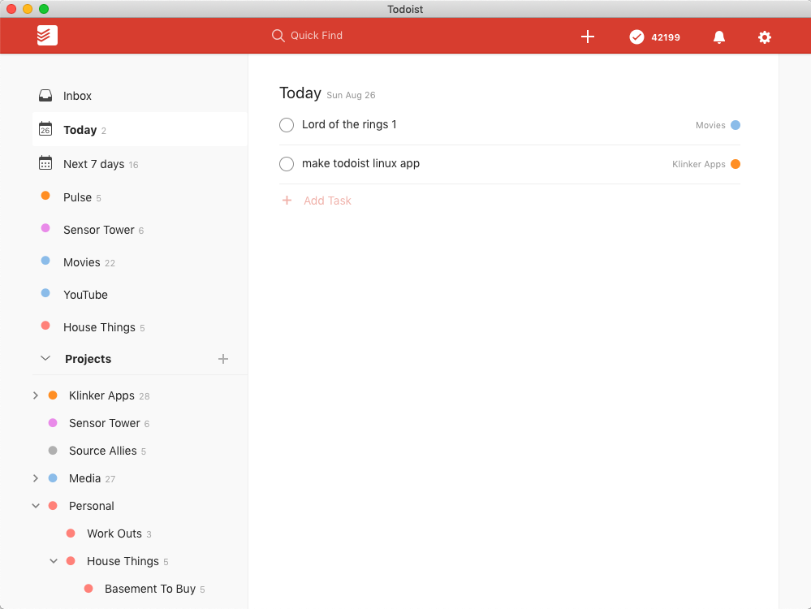

# Todoist - Desktop



I couldn't find a good Todoist desktop app, to use on my Pixelbook, so I made one. It will work on Mac, Linux, and Windows.

This desktop app is built on top of Electron's `BrowserView`, rather than Chromium's `webview`.

## Build Instructions

1. Install Electron and project dependencies:

```
$ npm install -g electron
$ yarn install
```

2. Run the app:

```
$ npm start
```

The app will only run if you have shut down any other instances. To ensure that only one web socket connection is made and managed, only a single instance of Pulse is allowed to run. If you use `npm start` while another instance is running, it will simply display the window of that old instance, instead of starting the app.

## Packaging Information

To package the apps for each platform:

```
$ yarn install

// MacOS (dmg)
$ ./node_modules/.bin/electron-builder build --mac

// Windows (installer with 32 and 64 bit support)
$ ./node_modules/.bin/electron-builder build --windows nsis --x64 --ia32

// Linux (deb and AppImage)
$ ./node_modules/.bin/electron-builder build --linux deb AppImage
```

## License

    Copyright 2018 Luke Klinker

    Licensed under the Apache License, Version 2.0 (the "License");
    you may not use this file except in compliance with the License.
    You may obtain a copy of the License at

       http://www.apache.org/licenses/LICENSE-2.0

    Unless required by applicable law or agreed to in writing, software
    distributed under the License is distributed on an "AS IS" BASIS,
    WITHOUT WARRANTIES OR CONDITIONS OF ANY KIND, either express or implied.
    See the License for the specific language governing permissions and
    limitations under the License.
